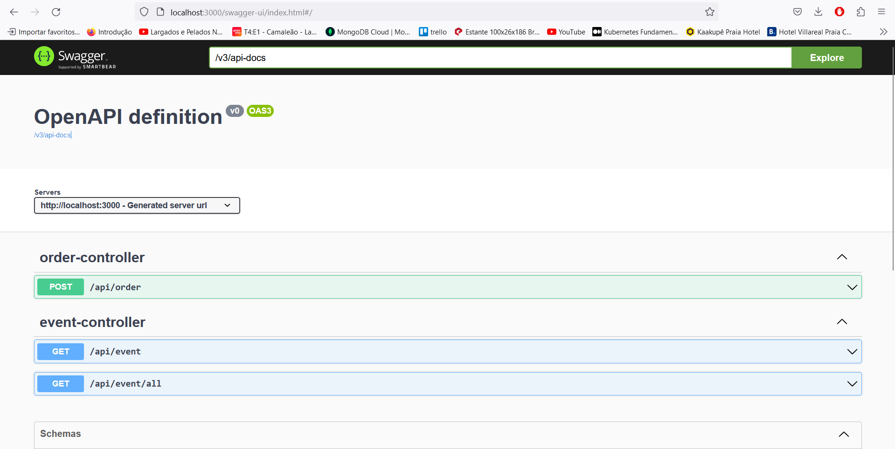

# Projeto: Arquitetura de Microsserviços: Padrão Saga Orquestrado - FIAP FASE 05

https://youtu.be/yv-C-m31od8
[ASSISTA À APRESENTAÇÃO DA SAGA: ](https://youtu.be/yv-C-m31od8)
### Sumário

* [Justificativa](#justificativa)
* [Relatório de Vulnerabilidades OWASP Zap](#relatório-de-vulnerabilidades-owasp-zap)
* [Relatório RIPD](#relatório-ripd)
* [Tecnologias](#tecnologias)
* [Ferramentas utilizadas](#ferramentas-utilizadas)
* [Arquitetura Proposta](#arquitetura-proposta)
* [Execução do projeto](#execução-do-projeto)
  * [01 - Execução geral via Kubernetes](#01---execução-geral-via-kubernetes)
* [Acessando a aplicação](#acessando-a-aplicação)
* [Acessando tópicos com Redpanda Console](#acessando-tópicos-com-redpanda-console)
* [Dados da API](#dados-da-api)
  * [Produtos registrados e seu estoque](#produtos-registrados-e-seu-estoque)
  * [Endpoint para iniciar a saga](#endpoint-para-iniciar-a-saga)
  * [Endpoint para visualizar a saga](#endpoint-para-visualizar-a-saga)
* [Autor](#autor)


## Justificativa


Ao assistir o módulo sobre o padrão Saga, optei pela Saga orquestrada, pois senti mais confiança em contar com um orquestrador para coordenar o fluxo. Considerando a arquitetura dos microsserviços que implementei, a decisão foi influenciada pelos seguintes pontos:

* **Maior Controle Centralizado: O Orchestrator-Service é responsável por coordenar as interações entre os microsserviços, o que facilita o controle do processo como um todo. Além disso, as lógicas de compensação ficam centralizadas, simplificando a gestão de fluxos complexos.**<br><br>

* **Facilidade na Implementação de Lógicas de Compensação: Como há um serviço centralizado gerenciando toda a execução da Saga, implementar ações de compensação para desfazer transações em caso de falhas torna-se mais simples e eficiente.**<br><br>

* **Desacoplamento entre Microsserviços: Cada microsserviço permanece focado em suas próprias responsabilidades e não precisa estar ciente de todo o fluxo da transação. Isso garante um baixo acoplamento e facilita a manutenção e evolução dos serviços.**<br><br>

* **Facilidade de Monitoramento e Debugging: Com o orquestrador gerenciando as etapas do processo, fica mais fácil monitorar e identificar possíveis falhas no fluxo, proporcionando uma visão centralizada da execução das transações e melhorando o diagnóstico de problemas.**<br>

## Relatório de Vulnerabilidades OWASP Zap

<b><h3>Obs:</h3><b/>
<p style="color: red;"> Ao rodar o OWASP ZAP, não detectou falhas, acredito que com minha experiência profissional e utilizando bibliotecas do spring e implementando com os padrões do spring, não foi possível a ferramenta encontrar falhas.
Utilizei o módulo do OWASP e o seguinte vídeo como exemplo para ver se não estava fazendo algo de errado</p>


[Assista ao vídeo API Security Testing With Postman & OWASP Zap - A quick walkthrough](https://www.youtube.com/watch?v=YDijuX-MyWY&t=354s&pp=ugMICgJwdBABGAHKBQ5vd2FzcCB6YXAgcG9zdA%3D%3D)

<b>Clique para exibir os relatórios:</b>

* **[Listar/exibir cardápio](assets/owaspzap/cardapyfirstatack.png)**
* **[Listar/exibir cardápio](assets/owaspzap/checkout.png)**
* **[Confirmação do Pagamento (Webhook)](assets/owaspzap/webhookpayment.png)**

Não foi possível realizar o da geração de pagamento, pois a saga é a responsável por gerar automaticamente, não sendo um processo "manual".

## Relatório RIPD
* **[Relatório de impacto dos dados pessoais (RIPD)](assets/relatorioRipd.pdf)**

## Tecnologias

[Voltar ao início](#sum%C3%A1rio)

* **Java 17**
* **Spring Boot 3**
* **Apache Kafka**
* **API REST**
* **PostgreSQL**
* **MongoDB**
* **Docker**
* **docker-compose**
* **Redpanda Console**

# Ferramentas utilizadas

[Voltar ao início](#sum%C3%A1rio)

* **IntelliJ IDEA Community Edition**
* **Docker**
* **Gradle**
* **Kubernetes**

# Arquitetura Proposta

[Voltar ao início](#sum%C3%A1rio)


Em nossa arquitetura, temos 5 serviços:

* **Order-Service**: microsserviço responsável apenas por gerar um pedido inicial, e receber uma notificação. 
* **Orchestrator-Service**: microsserviço responsável por orquestrar todo o fluxo de execução da Saga.
* **Product-Validation-Service**: microsserviço responsável por validar se o produto informado no pedido existe e está válido.
* **Payment-Service**: microsserviço responsável por realizar um pagamento com base nos valores unitários e quantidades informadas no pedido. 
* **Inventory-Service**: microsserviço responsável por realizar a baixa do estoque dos produtos de um pedido. 
* **Kitchen-Service**: microsserviço responsável por receber o pedido e atualizar o seu status.

Todos os serviços da arquitetura irão subir através do kubernetes.

## Execução do projeto

[Voltar ao início](#sum%C3%A1rio)

### 01 - Execução geral via Kubernetes

[Voltar ao nível anterior](#execu%C3%A7%C3%A3o-do-projeto)

Basta executar o comando no diretório raiz do repositório:

`kubectl apply -f .\kubernetes\namespaces\`,
`kubectl apply -f .\kubernetes\pvc\ `,
`kubectl apply -f .\kubernetes\configs-maps\`,
`kubectl apply -f .\kubernetes\services\`,
`kubectl apply -f .\kubernetes\deployments\`,

<p style="color: red">OBS: É NECESSÁRIO CRIAR UMA CONTA DE DESENVOLVEDOR NO MERCADO PAGO E GERAR OS TOKENS E ADICIONAR NO CONFIG-MAP ABAIXO PARA CONSEGUIR UTILIZAR O CHECKOUT </p>

`payment-service-config-map.yaml`

## Acessando a aplicação

[Voltar ao início](#sum%C3%A1rio)

Para acessar as aplicações e realizar um pedido, basta acessar a URL:

http://localhost:30000/swagger-ui.html

Você chegará nesta página:




As aplicações executarão nas seguintes portas:

* Order-Service: 30000
* Orchestrator-Service: 8080
* Product-Validation-Service: 8090
* Payment-Service: 8091
* Inventory-Service: 8092
* Kichen-Service: 8093
* Apache Kafka: 9092
* Redpanda Console: 8080
* PostgreSQL (Product-DB): 5432
* PostgreSQL (Payment-DB): 5433
* PostgreSQL (Inventory-DB): 5434
* PostgreSQL (Kitchen-DB): 5435
* MongoDB (Order-DB): 27017

## Acessando tópicos com Redpanda Console

[Voltar ao início](#sum%C3%A1rio)

Para acessar o Redpanda Console e visualizar tópicos e publicar eventos, basta acessar:

http://localhost:8080

Você chegará nesta página:


## Dados da API

[Voltar ao início](#sum%C3%A1rio)

É necessário conhecer o payload de envio ao fluxo da saga, assim como os produtos cadastrados e suas quantidades.

### Produtos registrados e seu estoque

[Voltar ao nível anterior](#dados-da-api)

Existem 3 produtos iniciais cadastrados no serviço `product-validation-service` e suas quantidades disponíveis em `inventory-service`:

* **X-BACON** (50 em estoque)
* **X-SALAD** (50 em estoque)
* **CHEESEBURGER** (50 em estoque)
* **X-EGG** (50 em estoque)
* **X-CHICKEN** (50 em estoque)
* **X-EVERYTHING** (50 em estoque)
* **X-EVERYTHING CHICKEN** (50 em estoque)
* **COKE 600m** (50 em estoque)
* **COKE** (50 em estoque)
* **FANTA ORANGE** (50 em estoque)
* **GUARANA** (50 em estoque)
* **GUARANA 600ml** (50 em estoque)
* **ICE-CREAM** (50 em estoque)
* **PASSION FRUIT MOUSSE** (50 em estoque)
* **CHEESEBURGER** (50 em estoque)
* **STRAWBERRY PIE** (50 em estoque)

### Endpoint para iniciar a saga:

[Voltar ao nível anterior](#dados-da-api)

**POST** http://localhost:3000/api/order

Payload:

```json
{
  "cpfCustomer": "string",
  "products": [
    {
      "product": {
        "code": "X-BACON",
        "unitValue": 15.00
      },
      "quantity": 1
    }
  ]
}
```

Resposta:

```json
{
  "id": "66e21bfc063508040d8c9912",
  "products": [
    {
      "product": {
        "code": "X-BACON",
        "unitValue": 15
      },
      "quantity": 1
    }
  ],
  "createdAt": "2024-09-11T22:38:52.345120083",
  "transactionId": "1726094332345_1d14b570-656a-42fa-96d0-3bdd934098b4",
  "totalAmount": null,
  "totalItems": 0,
  "customer": {
    "id": "252f00e8-f3d7-47a6-85d0-e2cf0ffbf4bc",
    "name": "Josefa Carla Dias",
    "cpf": "98418786400",
    "address": {
      "street": "teste",
      "city": "teste",
      "state": "teste"
    },
    "phone": "61999999999",
    "isActive": true
  }
}
```

### Endpoint para visualizar a saga:

[Voltar ao nível anterior](#dados-da-api)

É possível recuperar os dados da saga pelo **orderId** ou pelo **transactionId**, o resultado será o mesmo:

**GET** http://localhost:3000/api/event?orderId=64429e987a8b646915b3735f

**GET** http://localhost:3000/api/event?transactionId=1682087576536_99d2ca6c-f074-41a6-92e0-21700148b519

Resposta:

```json
{
    "id": "66e21bfc063508040d8c9913",
    "transactionId": "1726094332345_1d14b570-656a-42fa-96d0-3bdd934098b4",
    "orderId": "66e21bfc063508040d8c9912",
    "payload": {
      "id": "66e21bfc063508040d8c9912",
      "products": [
        {
          "product": {
            "code": "X-BACON",
            "unitValue": 15
          },
          "quantity": 1
        }
      ],
      "createdAt": "2024-09-11T22:38:52.345",
      "transactionId": "1726094332345_1d14b570-656a-42fa-96d0-3bdd934098b4",
      "totalAmount": 15,
      "totalItems": 1,
      "customer": {
        "id": "252f00e8-f3d7-47a6-85d0-e2cf0ffbf4bc",
        "name": "Josefa Carla Dias",
        "cpf": "98418786400",
        "address": {
          "street": "teste",
          "city": "teste",
          "state": "teste"
        },
        "phone": "61999999999", 
        "isActive": true
      },
    },
    "source": "ORCHESTRATOR",
    "status": "SUCCESS",
    "eventHistory": [
      {
        "source": "ORCHESTRATOR",
        "status": "SUCCESS",
        "message": "Saga started!",
        "createdAt": "2024-09-11T22:38:52.978"
      },
      {
        "source": "PRODUCT_VALIDATION_SERVICE",
        "status": "SUCCESS",
        "message": "Products are validated successfully",
        "createdAt": "2024-09-11T22:38:54.082"
      },
      {
        "source": "PAYMENT_SERVICE",
        "status": "SUCCESS",
        "message": "Payment realized successfully!",
        "createdAt": "2024-09-11T22:42:29.893"
      },
      {
        "source": "INVENTORY_SERVICE",
        "status": "SUCCESS",
        "message": "Inventory updated successfully!",
        "createdAt": "2024-09-11T22:42:31.13"
      },
      {
        "source": "KITCHEN_SERVICE",
        "status": "SUCCESS",
        "message": "Order finished successfully!",
        "createdAt": "2024-09-11T22:42:32.351"
      },
      {
        "source": "ORCHESTRATOR",
        "status": "SUCCESS",
        "message": "Saga finished!",
        "createdAt": "2024-09-11T22:42:32.682"
      }
    ],
    "createdAt": "2024-09-11T22:42:32.717"
  }
```


## Autor

### Luan Kenzley
### Desenvolvedor de Software Back-End
